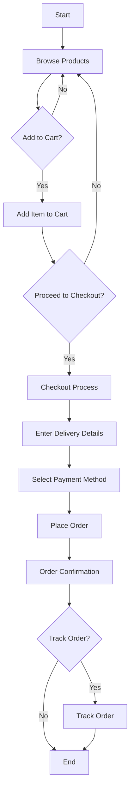

# Application Workflow Flowchart

## Explanation
1. **Browse Products**: Users can browse the available products.
2. **Add to Cart**: Users can add products to their shopping cart.
3. **Checkout Process**: Users can proceed to checkout, where they enter delivery details and select a payment method.
4. **Place Order**: Users can place the order, which is then confirmed.
5. **Track Order**: Users can track the status of their orders.
6. **End**: The process ends after order confirmation or tracking.
